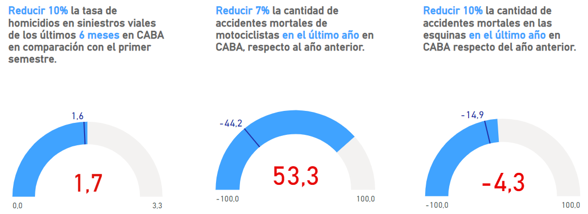

# Análisis de Homicidios Viales en la Ciudad Autónoma de Buenos Aires (CABA), Argentina.

## Introducción
Este proyecto emula el papel de un Analista de Datos dentro de un equipo de una consultora. El Observatorio de Movilidad y Seguridad Vial (OMSV), una entidad especializada adscrita a la Secretaría de Transporte del Gobierno de la Ciudad Autónoma de Buenos Aires, nos encargó desarrollar un análisis detallado de datos.

El propósito de este análisis es proveer a las autoridades de información clave para implementar estrategias que reduzcan el número de muertes resultantes de accidentes viales en CABA. Se nos ha proporcionado un conjunto de datos sobre los fallecimientos en accidentes viales entre 2016 y 2021 para este fin.

Los entregables del proyecto incluyen un informe detallado sobre las actividades realizadas, las metodologías empleadas, y las conclusiones principales, además de un dashboard interactivo que mejore la visualización y análisis de los datos.

## Contexto
Los accidentes de tránsito son incidentes que involucran vehículos y pueden ser causados por múltiples factores, resultando en daños materiales y/o físicos a los implicados. En la densamente poblada Ciudad Autónoma de Buenos Aires, con un tráfico considerable, estos eventos son una preocupación constante por su impacto en la seguridad pública, la infraestructura vial, y los servicios de emergencia.

Con una población de 3,120,612 habitantes en un área de 200 km2 según el censo de 2022, y más de 12 millones de vehículos circulando por sus autopistas en julio de 2023, la prevención de accidentes y la implementación de políticas de seguridad vial eficaces son cruciales.

## Datos
El análisis se basó en la Base de [Datos de Víctimas Fatales en Siniestros Viales](https://data.buenosaires.gob.ar/dataset/victimas-siniestros-viales), disponible en formato Excel con dos secciones: HECHOS y VÍCTIMAS, interconectadas por un ID único. Se proporcionan detalles sobre las definiciones y variables utilizadas en este documento, y los datos pueden consultarse aquí.

## Tecnologías Utilizadas
El proyecto involucró el uso de Python y Pandas para la manipulación de datos, seguido de un análisis exploratorio. Para estimar la población de 2021, se recurrio a un excel de la pagina de la ciudad de Buenos Aires en [INDEC](https://www.indec.gob.ar/indec/web/Nivel4-Tema-2-41-165). El dashboard interactivo fue desarrollado en Power BI y está disponible [aquí](./Presentación/Presentación_accidentes_CABA - MySQL.pbix)

## ETL, EDA y almacenamiento en la nube con Clever-Clud
Inicialmente, se realizó un ETL para limpiar y preparar los datos, seguido de un análisis exploratorio detallado (EDA) para identificar patrones relevantes para la toma de decisiones. Los detalles se encuentran aquí.

Tambien recurrimos a alojar nuestro dataset en un servidor en la nube [Clever-Cloud](https://console.clever-cloud.com/), para que PowerBi consulte online y se conecte a una base de MySQL.

## Análisis de Datos
El análisis realizado revela una serie de patrones significativos en relación con los homicidios, abordando variables temporales, perfiles de víctimas y distribución espacial.

En primer lugar, se observa una disminución notable en la cantidad de homicidios en el año 2020, atribuible a las medidas de cuarentena por COVID-19. Sin embargo, esta tendencia no se replica de manera consistente en años anteriores. Aunque diciembre destaca como un mes con un pico en el número de víctimas, esta tendencia no es uniforme en todos los años, sugiriendo una posible influencia de la flexibilización de las restricciones de cuarentena en los patrones de homicidios.

Al analizar escalas temporales más detalladas, se encuentra que la mayoría de los homicidios ocurren entre lunes y viernes, lo que podría relacionarse con el traslado diario al trabajo. Sin embargo, no se observan diferencias significativas en la distribución de víctimas entre los días de la semana. Además, un porcentaje considerable de las víctimas se registra en las primeras horas de la mañana, aunque la mayoría de estos incidentes ocurrieron durante el fin de semana.

En cuanto al perfil de las víctimas, se destaca que la mayoría son hombres, en su mayoría dentro del rango de edad de 25 a 35 años. Cerca de la mitad de las víctimas son conductores, principalmente de motocicletas, y la responsabilidad del accidente recae principalmente en vehículos como automóviles, colectivos y camiones.

En términos de distribución espacial, los accidentes en las avenidas son comunes en todas las comunas de la Ciudad Autónoma de Buenos Aires, con la mayoría de las víctimas perdiendo la vida en estos lugares, especialmente en los cruces con otras calles. El rol de la víctima varía entre moto y peatón dependiendo de la comuna.

Este análisis integral proporciona una visión detallada de los patrones temporales, el perfil de las víctimas y los factores espaciales relacionados con los homicidios, lo que puede ser fundamental para identificar áreas de enfoque en términos de prevención y políticas públicas orientadas a la seguridad ciudadana.

## KPI
En función del análisis previo, se establecieron tres objetivos para reducir la cantidad de víctimas fatales en siniestros viales, cada uno asociado a un indicador clave de rendimiento (KPI).

Reducir en un 10% la tasa de homicidios en siniestros viales de los últimos seis meses en CABA, en comparación con el semestre anterior:
Este KPI se basa en la Tasa de homicidios en siniestros viales, que mide el número de víctimas fatales en accidentes de tránsito por cada 100,000 habitantes durante un período específico. Se calcula dividiendo el número de homicidios en siniestros viales por la población total y multiplicando por 100,000. Para el año 2021. El objetivo era reducir la tasa en un 10% para el segundo semestre de 2021, lo que equivale a 1.61. Sin embargo, el KPI resultante fue de 1.66, indicando que se no se cumplió con el objetivo propuesto.

Reducir en un 7% la cantidad de accidentes mortales de motociclistas en el último año en CABA, respecto al año anterior:
Este indicador se basa en la Cantidad de accidentes mortales de motociclistas, que mide el cambio porcentual en el número de accidentes mortales en los que estuvieron involucrados motociclistas entre dos años consecutivos. El objetivo era no soprepasar -44.2 para 2021, lo que representa una reducción del 7%. Sin embargo, el valor obtenido para 2021 fue de 53,3, indicando un aumento del 53% en comparación con 2020, lo que no cumple con el objetivo establecido.

Reducir en un 10% los homicidios en las avenidas en el último año en CABA, respecto al año anterior:
Este KPI se basa en los homicidios en las avenidas, que mide el número de víctimas fatales en accidentes de tránsito durante un año. Para el año 2020, fue de 69 victimas, y el objetivo era reducirla a 62 para 2021, lo que representa una disminución del 10%. Sin embargo, el número de víctimas para 2021 fue de 66 victimas, indicando una disminución de homicidios en las avenidas en comparación con el año anterior, pero aún asi insuficiente e incumpliendo así el objetivo establecido.

La imagen adjunta muestra los rendimientos de estos tres KPI propuestos.

## ESTRUCTURA DEL REPOSITORIO
Carpetas
*  **Imagenes:** podrás encontrar imagenes que usa el repositorio.

*  **Notebooks:** Dentro de esta carpeta encontrarás dos archivos .ipynb. Los cuales son [01_ETL](Notebooks/01_ETL.ipynb) y [02_EDA](Notebooks/02_EDA.ipynb). Los cuales contienen todo el análisis hecho sobre el dataset de accidentes de la página de la ciudad de Buenos Aires.

*  **Presentación:** Aqui podrás encontrar la presentación del análisis en un archivo de PowerBI.

*  **Readme:** Incluye un reporte de análisis en base al dashboard y análisis de los KPI sugeridos.

## CONCLUSIONES
El análisis de los siniestros viales en la Ciudad de Buenos Aires entre 2016 y 2021 revela patrones críticos que deben ser abordados con urgencia. 

Con 694 accidentes y 759 víctimas mortales en este período, es evidente la necesidad de acciones concretas para mejorar la seguridad vial. La tendencia al alza de accidentes en diciembre y la disminución observada durante los años de pandemia resaltan el impacto de factores temporales en la incidencia de estos siniestros. 

Además, el perfil predominante de las víctimas, siendo en su mayoría hombres de entre 30 y 45 años, y el rol significativo de motocicletas y automóviles en estos eventos, subrayan áreas específicas para intervenciones dirigidas.

En este contexto, se recomienda la implementación de campañas de concienciación enfocadas en los conductores de motocicletas y automóviles, especialmente dirigidas a los grupos de edad más afectados. Estas campañas deben enfatizar la importancia del respeto a las normas de tráfico, el uso de cascos y cinturones de seguridad, y la conducción responsable. Además, es crucial mejorar la infraestructura vial en puntos críticos identificados, como esquinas y avenidas donde ocurre el mayor número de accidentes, así como en los barrios con mayores índices de siniestralidad.

Finalmente, se sugiere fortalecer la recopilación y análisis de datos sobre siniestros viales, facilitando así la identificación de tendencias, la evaluación de políticas implementadas y la adaptación de estrategias a las necesidades cambiantes. 

La colaboración entre distintas entidades gubernamentales, organizaciones de la sociedad civil y el sector privado será fundamental para lograr una reducción significativa en el número de víctimas fatales por siniestros viales en Buenos Aires y en toda Argentina.
